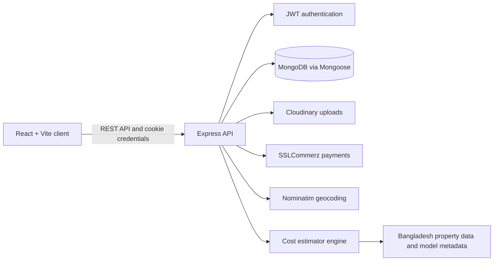
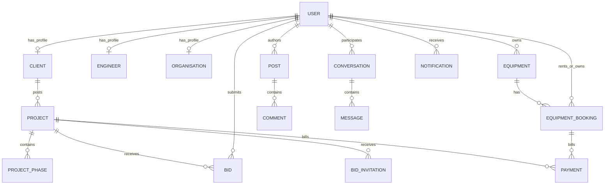

# CivilHub Project Documentation

## 1. Overview

CivilHub is a full-stack construction and civil-engineering platform for Bangladesh. It connects clients who need construction work with engineers and organisations that provide project services or rent equipment.

The platform supports three account roles:

| Role         | Primary purpose                                                                                                                          |
| ------------ | ---------------------------------------------------------------------------------------------------------------------------------------- |
| Client       | Posts projects, reviews bids, hires providers, tracks work, rents equipment, and pays for services.                                      |
| Engineer     | Maintains a professional profile, finds and bids on projects, manages assigned work, networks with other providers, and lists equipment. |
| Organisation | Represents a company. Its declared services determine whether it can provide project work, rent equipment, or both.                      |

Key product areas include project marketplace and bidding, project-progress phases, equipment rental, provider search and networking, direct messaging, a professional social feed, reviews, payments, safety controls, and a building-cost estimator.

## 2. Architecture



### Frontend

The client application is in `client/` and uses React, TypeScript, Vite, React Router, Tailwind CSS, Framer Motion, Leaflet, and React Leaflet.

- `src/App.tsx` owns the application route tree and access boundaries.
- `src/context/AuthContext.tsx` maintains the authenticated session for the UI.
- `src/components/` contains reusable presentation and domain components.
- `src/pages/` contains route-level experiences.
- `src/lib/` contains route helpers, formatting utilities, project criteria, payment helpers, and domain constants.

Routes are split into a client dashboard, a shared provider dashboard for engineers and organisations, and protected shared pages for profiles, messaging, feed, notifications, payments, and account settings.

### Backend

The server is in `server/` and uses Node.js, TypeScript, Express 5, Mongoose, JWT, cookie-based sessions, Multer, Cloudinary, SSLCommerz, and Jest.

- `src/index.ts` configures middleware, route modules, health checks, and startup tasks.
- `src/routes/` defines REST resources and request middleware.
- `src/controllers/` implements request handling and domain rules.
- `src/models/` contains Mongoose schemas and persistence constraints.
- `src/middleware/` provides authentication, errors, uploads, and rate limits.
- `src/services/` contains integrations and reusable business services.
- `src/ml/` contains the building-cost estimator prediction and model artifacts.

The API is served on port `5000` by default. The Vite client defaults to port `5173`.

## 3. Local Setup

### Prerequisites

- Node.js and npm
- A MongoDB deployment or local MongoDB instance
- Python 3 when using the optional Python-backed estimator prediction path
- Cloudinary credentials when testing media uploads
- SSLCommerz sandbox or production credentials when testing payment checkout

### Install dependencies

Run the following from the repository root:

```powershell
npm install
npm --prefix server install
npm --prefix client install
```

### Server configuration

Copy `server/.env.example` to `server/.env`, then configure the values required for the features you are running. Do not commit `server/.env` or real secrets.

| Variable                    | Required                   | Description                                                                        |
| --------------------------- | -------------------------- | ---------------------------------------------------------------------------------- |
| `MONGODB_URI`               | Yes for persistence        | MongoDB connection string.                                                         |
| `JWT_SECRET`                | Yes for protected requests | Secret used to sign and verify session tokens.                                     |
| `PORT`                      | No                         | API port; defaults to `5000`.                                                      |
| `CLIENT_URL`                | No                         | Allowed browser origin for credentialed CORS; defaults to `http://localhost:5173`. |
| `SERVER_URL`                | No                         | Public API base URL for payment callbacks; defaults to the local server URL.       |
| `CLOUDINARY_CLOUD_NAME`     | Uploads only               | Cloudinary cloud name.                                                             |
| `CLOUDINARY_API_KEY`        | Uploads only               | Cloudinary API key.                                                                |
| `CLOUDINARY_API_SECRET`     | Uploads only               | Cloudinary API secret.                                                             |
| `SSLCOMMERZ_STORE_ID`       | Payments only              | SSLCommerz merchant store ID.                                                      |
| `SSLCOMMERZ_STORE_PASSWORD` | Payments only              | SSLCommerz merchant password.                                                      |
| `SSLCOMMERZ_IS_SANDBOX`     | No                         | Uses sandbox mode unless set to `false`.                                           |
| `PLATFORM_COMMISSION_RATE`  | No                         | Platform commission as a decimal; defaults to `0.1`.                               |
| `NOMINATIM_URL`             | No                         | Geocoding endpoint; defaults to the public Nominatim service.                      |
| `NOMINATIM_CONTACT`         | Recommended                | Contact identifier used for geocoding requests.                                    |

The client optionally accepts `VITE_API_URL`. When omitted, it communicates with `http://localhost:5000`.

### Start the application

Open two terminals in the repository root:

```powershell
npm run dev:server
```

```powershell
npm run dev:client
```

Open `http://localhost:5173`. Confirm the server is reachable at `http://localhost:5000/api/health`.

Keep `CLIENT_URL` aligned with the Vite origin. The API allows credentials only from that configured origin.

## 4. Scripts and Validation

| Command                           | Purpose                                              |
| --------------------------------- | ---------------------------------------------------- |
| `npm run dev:server`              | Starts the TypeScript Express server in watch mode.  |
| `npm run dev:client`              | Starts the Vite development server.                  |
| `npm run build`                   | Builds server and client sequentially.               |
| `npm run db:reset`                | Runs the server's database reset/seed script.        |
| `npm --prefix server run build`   | Type-checks and compiles the server into `dist/`.    |
| `npm --prefix server run test`    | Runs Jest tests serially.                            |
| `npm --prefix client run build`   | Type-checks and produces the Vite production bundle. |
| `npm --prefix client run lint`    | Runs Oxlint for the client.                          |
| `npm --prefix client run preview` | Serves the built client bundle locally.              |

There is no root test command and no client test script at present.

## 5. User Roles and Capabilities

### Clients

Clients create and manage project briefs, receive and accept or decline bids, invite providers to quote, follow project progress, rate completed work, rent equipment, pay for milestones or bookings, browse professionals, post customer feedback, and use the estimator.

### Engineers

Engineers maintain qualifications, portfolios, certificates, and their professional profile. They can search marketplace projects, submit or respond to bids, manage awarded projects and phases, receive reviews, connect with other providers, participate in social features, and list equipment for rental.

### Organisations

Organisations use the provider dashboard and maintain their company profile, logo, and portfolio. The `services` field controls eligibility:

- `projects` permits project marketplace and bid activity.
- `equipment` permits equipment listings and fleet management.

An equipment-only organisation is redirected to its equipment tools instead of project-oriented screens.

## 6. Core Workflows

### Project marketplace

1. A client posts a project brief with scope, budget, location, and criteria.
2. Eligible engineers or project-service organisations browse open projects or receive invitations.
3. Providers submit bids or accept/decline invitations.
4. The project owner reviews bids and selects a provider.
5. The selected provider and client work through project phases and status updates.
6. After completion, each eligible participant can leave a review.

### Project progress

Projects may contain phases represented by `ProjectPhase` records. Participants can submit phase work, request or record changes, and approve completed work according to their role and project ownership. Project history preserves completed engagements for the relevant dashboards.

### Equipment rental

1. Providers create equipment listings, availability, and pricing details.
2. Any signed-in role can browse a listing, review availability, request a quote, and create a booking.
3. The owner responds to the booking; the renter and owner track pickup, return, condition, deposit, and payment state.
4. Once a booking is completed and its deposit is resolved, eligible participants can review the experience.

### Payments

The application creates payment records for projects, phases, and equipment bookings. Checkout is initiated through the API and SSLCommerz posts its success, failure, cancellation, and IPN callbacks to the server. Payment result pages in the client surface the final result to the payer.

### Professional network and communication

Provider-to-provider networking supports connection requests, suggestions, incoming and sent requests, acceptance, decline, and removal. Conversations support two-user messaging, read status, project context, and block-aware access. The feed supports provider posts, likes, reposts, and comments.

### Safety controls

Signed-in users can block other users and submit reports for supported user-generated content or accounts. These controls also affect permitted social and communication interactions.

## 7. Building Cost Estimator

The cost estimator combines Bangladesh house-listing data with construction-oriented cost and material calculations.

- `house_price_bd.csv` is the source listing dataset.
- `server/ml/train_model.py` prepares training-derived metadata.
- `server/ml/model_meta.json` stores location and calculation metadata.
- `server/ml/predict.py` implements the Python prediction path.
- `CostEstimate` stores saved estimates.

The estimator collects location, neighbourhood, building type, finish quality, floor area, and storey count. It returns estimated construction cost, market valuation, cost categories, material bill of quantities, and a phase-oriented timeline. Authenticated eligible users can save estimates and use an estimate to prefill a project post.

The detailed feature report is available in `BUILDING_COST_ESTIMATOR_REPORT.md`.

## 8. API Overview

All API paths are prefixed with `/api` unless noted. Protected routes use the `civilhub_token` JWT cookie. Controllers apply additional ownership and role checks even where a route group is protected.

| Resource             | Base path                        | Main responsibilities                                                                                                |
| -------------------- | -------------------------------- | -------------------------------------------------------------------------------------------------------------------- |
| Service              | `/` and `/api/health`            | API status and health checks.                                                                                        |
| Authentication       | `/api/auth`                      | Signup, login, logout, current session, profile, email, and password settings.                                       |
| Client profile       | `/api/clients`                   | Client profile details and profile photo.                                                                            |
| Engineer profile     | `/api/engineers`                 | Engineer search, public reviews, own professional profile, photos, certificates, and portfolio.                      |
| Organisation profile | `/api/organisations`             | Organisation profile, logo, and portfolio management.                                                                |
| Projects             | `/api/projects`                  | Open projects, criteria, briefs, creation, ownership views, history, progress, phases, reviews, and project changes. |
| Dashboards           | `/api/dashboard`                 | Client and provider dashboard summaries.                                                                             |
| Bids                 | `/api/bids`                      | Create bids, view provider/client bid lists, and accept or decline bids.                                             |
| Invitations          | `/api/bid-invitations`           | Client invitations to providers and provider responses.                                                              |
| Equipment            | `/api/equipment`                 | Listing management, browsing, detail, availability, quotes, and equipment reviews.                                   |
| Bookings             | `/api/equipment-bookings`        | Equipment booking creation, participant lists, lifecycle, return, deposit, and booking review eligibility.           |
| Payments             | `/api/payments`                  | Checkout, transaction lookup, and SSLCommerz callback handling.                                                      |
| Estimator            | `/api/cost-estimator`            | Locations, prediction, saving, history, retrieval, and deletion of estimates.                                        |
| Network              | `/api/network`                   | Provider connections, suggestions, and request lifecycle.                                                            |
| Conversations        | `/api/conversations`             | Conversation creation, inbox, message sending, reading, and participant access.                                      |
| Users                | `/api/users`                     | Public profile, posts, and customer reviews.                                                                         |
| Social               | `/api/posts` and `/api/comments` | Feed, posts, likes, reposts, and comments.                                                                           |
| Notifications        | `/api/notifications`             | Notification list and read state.                                                                                    |
| Reviews              | `/api/reviews`                   | Project/equipment/customer reviews and provider replies.                                                             |
| Geocoding            | `/api/geo`                       | Location search and reverse geocoding.                                                                               |
| Safety               | `/api/blocks` and `/api/reports` | Blocking, report submission, and moderation inputs.                                                                  |

Important access rules:

- Login and signup have authentication rate limits.
- Social writes are rate-limited for network, posts, comments, conversations, reports, and blocks.
- Project creation and bid decisions are client-owned actions.
- Project bids require an eligible provider with the project service capability.
- Equipment listing actions require provider ownership and equipment service capability for organisations.
- Equipment renters are not limited to the client role.
- Review eligibility depends on completed project or booking lifecycle state and participant ownership.
- Payment-provider callbacks are intentionally public because they originate outside the browser session.

## 9. Data Model



### Principal entities

| Entity                                  | Purpose                                                                    |
| --------------------------------------- | -------------------------------------------------------------------------- |
| `User`                                  | Account root with immutable role: `client`, `engineer`, or `organisation`. |
| `Client`, `Engineer`, `Organisation`    | One-to-one role profile records linked to `User`.                          |
| `Project`, `ProjectPhase`               | Client work requests, selected provider engagement, and phase tracking.    |
| `Bid`, `BidInvitation`                  | Provider offers and targeted client invitations.                           |
| `Equipment`, `EquipmentBooking`         | Rental listings and their renter/owner lifecycle.                          |
| `Payment`                               | Financial record attached to project/phase or equipment booking scopes.    |
| `Review`, `CustomerReview`              | Provider and customer feedback linked to completed work or bookings.       |
| `Post`, `Comment`                       | Professional community content and discussion.                             |
| `Connection`, `Conversation`, `Message` | Provider network graph and direct messages.                                |
| `Notification`                          | User-facing event notifications.                                           |
| `Block`, `Report`                       | Safety and moderation records.                                             |
| `CostEstimate`                          | Saved building-cost estimator results, optionally owned by a user.         |

## 10. Security and Operational Notes

- Authentication uses JWTs stored in the `civilhub_token` cookie.
- CORS is credentialed and limited to `CLIENT_URL`.
- Route protection is supplemented by resource ownership and role checks in domain controllers.
- Never expose `.env` values, JWT secrets, Cloudinary credentials, or payment provider credentials in client code or repository history.
- Media uploads use Cloudinary; validate file type and size through the upload middleware before expanding upload features.
- External services such as Nominatim and SSLCommerz should be configured with valid contact, callback, and production URLs before deployment.
- The server performs startup maintenance for legacy payment statuses, completed project statuses, and stale network data.

## 11. Deployment Checklist

1. Set production `MONGODB_URI`, `JWT_SECRET`, `CLIENT_URL`, and `SERVER_URL`.
2. Configure Cloudinary and SSLCommerz production values where those features are enabled.
3. Set `SSLCOMMERZ_IS_SANDBOX=false` only after payment callback URLs are deployed and verified.
4. Build both applications with `npm run build`.
5. Run server tests and client lint/build checks.
6. Serve the compiled server from `server/dist/index.js` and host the client build output through a static web server or CDN.
7. Confirm `/api/health`, login, credentialed browser calls, uploads, payment callbacks, and geocoding behavior in the deployed environment.

## 12. Repository Map

```text
civilHub/
|- client/                         React + Vite application
|  |- src/components/              Reusable UI and domain components
|  |- src/context/                 Authentication context
|  |- src/lib/                     Client domain helpers
|  `- src/pages/                   Route-level application screens
|- server/                         Express + MongoDB API
|  |- ml/                          Estimator scripts and metadata
|  `- src/
|     |- controllers/              Domain request handlers
|     |- middleware/               Authentication, uploads, errors, limits
|     |- models/                   Mongoose persistence models
|     |- routes/                   REST endpoint definitions
|     `- services/                 External and domain services
|- docs/                           Project documentation
|- BUILDING_COST_ESTIMATOR_REPORT.md
|- house_price_bd.csv
`- civilhub.postman_collection.json
```
